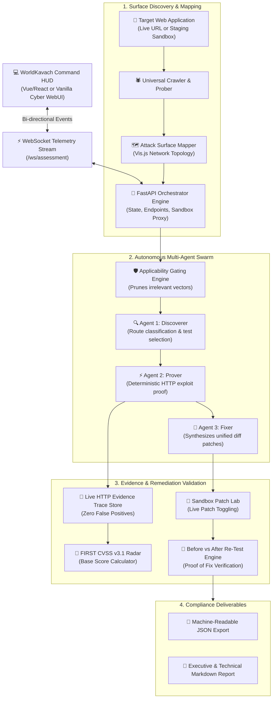

# 🛡️ WorldKavach &mdash; Autonomous AI DAST & Cyber Defense Platform

<div align="center">


[](LICENSE)
[](https://python.org)
[](https://fastapi.tiangolo.com)
[](#system-architecture)
[](#autonomous-multi-agent-workflow)
[](#cvss-v31-scoring-engine)
[](#docker-deployment)

**Enterprise-Grade Dynamic Application Security Testing (DAST) with Autonomous Multi-Agent Triage, Live HTTP Evidence Proofs, and Surgical Patch Verification.**

[Live Telemetry](#live-telemetry--command-center) &bull; [Architecture](#system-architecture) &bull; [Multi-Agent Swarm](#autonomous-multi-agent-workflow) &bull; [Quick Start](#quick-start) &bull; [Deployment Guide](#production-deployment-guide) &bull; [API Docs](#api--telemetry-stream)

</div>

---

## 📌 Executive Overview

**WorldKavach** (कवच - *The Armor*) is a next-generation, autonomous Dynamic Application Security Testing (DAST) platform engineered to defend modern web applications against advanced attack vectors. 

Traditional vulnerability scanners flood security teams with noisy, theoretical alerts. **WorldKavach** operates under a strict **Evidence-First Verification Paradigm**: a vulnerability is only promoted to a verified finding if our deterministic prover captures reproducible live HTTP request/response traces in real time, eliminating false positives by design.

### 🌟 Core Pillars

1. **Universal Target Scanning**: Dynamically audits any arbitrary web application URL or localized staging environment for modern security defects (CSP bypasses, SSRF DNS rebinding, CORS origin reflection, prompt injections, and header policies).
2. **Deterministic Live Evidence Proofs**: Every vulnerability finding is backed by complete HTTP wire traces, status codes, execution durations, and cURL reproduction scripts.
3. **Autonomous 3-Agent Swarm**:
   - 🔍 **AST Discoverer**: Crawls endpoints, maps the application attack surface, and constructs a live Vis.js topology graph.
   - ⚡ **DAST Prover**: Performs deterministic exploit replay with strict applicability gating.
   - 🔧 **Surgical Fixer**: Synthesizes verified code diffs and patch recommendations.
4. **Automated Sandbox Before vs After Re-Testing**: Validates that generated remediation diffs neutralize the vulnerability without breaking functionality.
5. **Holographic SecOps HUD**: Sleek, lightweight, cyber-command interface with real-time WebSocket telemetry, interactive node drawers, and single-click compliance exports (JSON, Markdown, PDF).

---

## 🏗️ System Architecture



---

## ⚡ Autonomous Multi-Agent Workflow

WorldKavach executes a decoupled, state-machine driven assessment orchestrated by specialized autonomous agents:

```
[TARGET URL]
     │
     ▼
┌────────────────────────────────────────────────────────┐
│  AGENT 1: AST & SURFACE DISCOVERER                     │
│  - Deep DOM route crawling & asset parsing            │
│  - Authentication endpoint classification             │
│  - Interactive Vis.js topology graph synthesis        │
└───────────────────────────┬────────────────────────────┘
                            │
                            ▼
┌────────────────────────────────────────────────────────┐
│  APPLICABILITY & RELEVANCE ENGINE                      │
│  - Filters out static asset noise                     │
│  - Gathers targeted test candidates                   │
└───────────────────────────┬────────────────────────────┘
                            │
                            ▼
┌────────────────────────────────────────────────────────┐
│  AGENT 2: DAST PROVER & EXPLOIT ANALYZER               │
│  - Executes deterministic HTTP probes                 │
│  - Bypasses static security filters                   │
│  - Records live status code, body, & latency          │
│  - Status: Candidate ➔ Verified (or Pruned)          │
└───────────────────────────┬────────────────────────────┘
                            │
                            ▼
┌────────────────────────────────────────────────────────┐
│  AGENT 3: SURGICAL FIXER & RE-TEST VERIFIER            │
│  - Synthesizes clean unified diff code patches        │
│  - Deploys patch into controlled sandbox              │
│  - Executes automated Before vs After Re-Test         │
│  - Status: Fix Verified                               │
└────────────────────────────────────────────────────────┘
```

---

## 🔍 Verified Vulnerability Case Studies

WorldKavach includes live simulation and real-world probers for critical vulnerability classes:

### 1. Script Controls Bypass via Static CSP Nonce (`FIND-WK-001`)
* **CVSS v3.1:** `9.3 (Critical)` &bull; `CVSS:3.1/AV:N/AC:L/PR:N/UI:R/S:C/C:H/I:H/A:N`
* **Vulnerability:** Static nonce tokens hardcoded into HTTP response headers (`nonce-wm-static-bootstrap`). An attacker injecting unvetted HTML uses the static nonce to execute arbitrary XSS payloads.
* **Prover Proof:** Captures response headers showing non-varying nonce tokens across consecutive sessions.
* **Surgical Fix:** Replaces static nonce with dynamic per-request cryptographic nonces and strict `strict-dynamic` policies.

### 2. SSRF via TOCTOU DNS Rebinding in Outbound MCP Proxy (`FIND-WK-002`)
* **CVSS v3.1:** `7.1 (High)` &bull; `CVSS:3.1/AV:N/AC:H/PR:L/UI:N/S:C/C:H/I:L/A:N`
* **Vulnerability:** Hostname validation inspects destination via public DoH at check time, but edge fetch fails to pin the resolved IP socket, allowing dual-resolution DNS rebinding to access private metadata (`169.254.169.254`).
* **Surgical Fix:** Pins DNS resolution at socket initiation and enforces private IP blocklists.

### 3. Indirect Prompt Injection in AI Analyst (`FIND-WK-004`)
* **CVSS v3.1:** `5.4 (Medium)` &bull; `CVSS:3.1/AV:N/AC:L/PR:L/UI:N/S:U/C:L/I:L/A:N`
* **Vulnerability:** User prompt parameters concatenated directly into LLM context without XML boundary encapsulation.
* **Surgical Fix:** Strict XML delimiter tagging (`<user_query>`) and output classification guardrails.

---

## 🚀 Quick Start

### Prerequisites
* Python 3.10 or higher
* `pip` and `git`

### 1. Clone the Repository
```bash
git clone https://github.com/vishesh-017/worldkavach.git
cd worldkavach
```

### 2. Install Dependencies
```bash
pip install -r backend/requirements.txt
```

### 3. Launch WorldKavach
```bash
python run_assessment.py
```
WorldKavach will launch its autonomous orchestrator and automatically open the Command HUD in your browser at:
👉 **`http://127.0.0.1:8000/`**

---

## 🐳 Docker Deployment

### Run with Docker Compose
WorldKavach includes production-ready Docker configurations:

```bash
# Build and run containers
docker compose up --build -d
```

* **Command HUD Dashboard**: `http://localhost:8000/`
* **Interactive API Documentation**: `http://localhost:8000/docs`
* **WebSocket Stream**: `ws://localhost:8000/ws/assessment`

---

## 🌐 Production Deployment Guide

Deploying WorldKavach on a Cloud VPS (Ubuntu / Debian / AWS EC2 / DigitalOcean Droplet):

### Step 1: Server Setup & Dependencies
```bash
sudo apt update && sudo apt upgrade -y
sudo apt install -y python3-pip python3-venv git nginx certbot python3-certbot-nginx
```

### Step 2: Clone and Setup Virtual Environment
```bash
cd /opt
sudo git clone https://github.com/vishesh-017/worldkavach.git
cd worldkavach
sudo python3 -m venv venv
sudo ./venv/bin/pip install -r backend/requirements.txt
```

### Step 3: Configure Systemd Service
Create `/etc/systemd/system/worldkavach.service`:
```ini
[Unit]
Description=WorldKavach Autonomous DAST Security Platform
After=network.target

[Service]
User=www-data
Group=www-data
WorkingDirectory=/opt/worldkavach
ExecStart=/opt/worldkavach/venv/bin/uvicorn backend.app.main:app --host 127.0.0.1 --port 8000 --workers 4
Restart=always
RestartSec=5

[Install]
WantedBy=multi-user.target
```

Enable and start the service:
```bash
sudo systemctl daemon-reload
sudo systemctl enable --now worldkavach
sudo systemctl status worldkavach
```

### Step 4: Configure Nginx Reverse Proxy
Create `/etc/nginx/sites-available/worldkavach`:
```nginx
server {
    server_name your-domain.com;

    location / {
        proxy_pass http://127.0.0.1:8000;
        proxy_http_version 1.1;
        proxy_set_header Upgrade $http_upgrade;
        proxy_set_header Connection "upgrade";
        proxy_set_header Host $host;
        proxy_set_header X-Real-IP $remote_addr;
        proxy_set_header X-Forwarded-For $proxy_add_x_forwarded_for;
        proxy_set_header X-Forwarded-Proto $scheme;
    }
}
```

Enable the configuration and obtain free SSL:
```bash
sudo ln -s /etc/nginx/sites-available/worldkavach /etc/nginx/sites-enabled/
sudo nginx -t
sudo systemctl restart nginx
sudo certbot --nginx -d your-domain.com
```

---

## 📡 API & Telemetry Stream

| Endpoint | Method | Description |
| :--- | :--- | :--- |
| `/` | `GET` | Serves the WorldKavach Command HUD |
| `/ws/assessment` | `WebSocket` | Real-time bi-directional telemetry event stream |
| `/api/assessment/state` | `GET` | Snapshot of orchestrator status, KPIs, and findings |
| `/api/assessment/start` | `POST` | Dispatches autonomous assessment for target URL |
| `/api/assessment/attack-surface` | `GET` | Complete Vis.js attack topology graph data |
| `/api/assessment/probe-endpoint` | `POST` | Live interactive HTTP prober with security header audit |
| `/api/assessment/retest/{id}` | `POST` | Triggers before-and-after fix re-test verification |
| `/api/target/toggle-fix/{id}` | `POST` | Toggles sandbox vulnerability patch state |
| `/api/cvss/calculate` | `GET` | Computes FIRST CVSS v3.1 vector and score |
| `/api/assessment/report/json` | `GET` | Downloads full JSON assessment deliverable |
| `/api/assessment/report/markdown`| `GET` | Downloads technical Markdown assessment audit report |

---

## 👥 Security Clearance Personas

WorldKavach supports RBAC clearance tiers:
* **Chief Security Auditor (Clearance L4)**: Full governance oversight, executive posture KPIs, and compliance exports.
* **Red Team Operator (Clearance L3)**: Interactive live HTTP probers, attack surface graph exploration, and exploit proof replay.
* **DevSecOps Engineer (Clearance L2)**: Sandbox patch lab, unified diffs, and automated before vs after re-test verification.

---

## 🔒 License & Intellectual Property Rights

**PROPRIETARY AND CONFIDENTIAL — ALL RIGHTS RESERVED.**  
Copyright &copy; 2026 Vishesh (@vishesh-017) &amp; WorldKavach Contributors.

This software, its source code, architecture, multi-agent AI triage algorithms, deterministic DAST replay engine, and Command HUD interface are proprietary and protected under international copyright and intellectual property laws.

* **❌ No Copying**: Reproduction, scraping, extraction, or distribution in any form is strictly prohibited.
* **❌ No Forking or Derivatives**: Creating public or private forks, mirrors, or derivative works is unauthorized and constitutes willful copyright infringement.
* **❌ No Redistribution or Cloning**: Hosting, sublicensing, or mirroring this codebase on any public or private platform is forbidden.
* **❌ No AI Model Training Ingestion**: Using this codebase for training or fine-tuning machine learning models without express written permission is prohibited.

For complete legal terms and conditions, consult the official [LICENSE](LICENSE) file. Unauthorized use, cloning, or distribution will be met with immediate DMCA takedown notices and legal enforcement.
